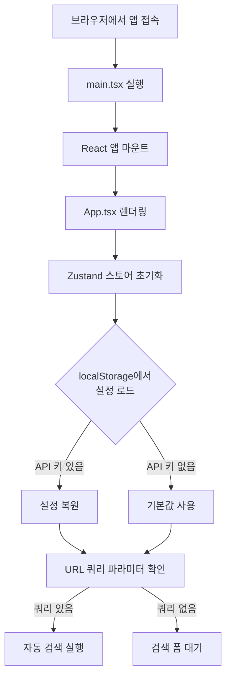
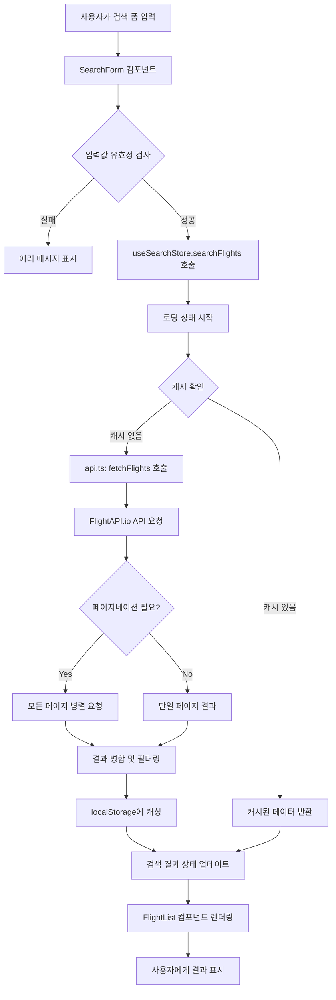
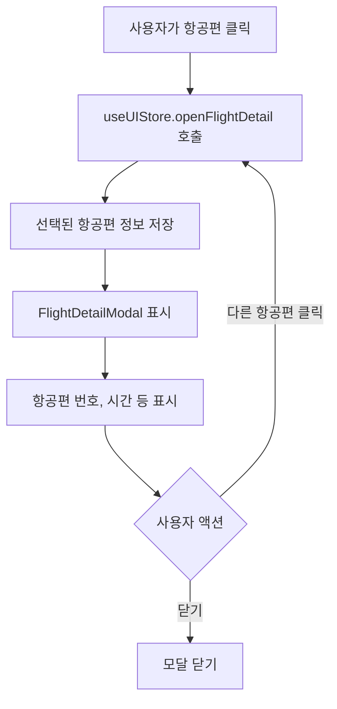
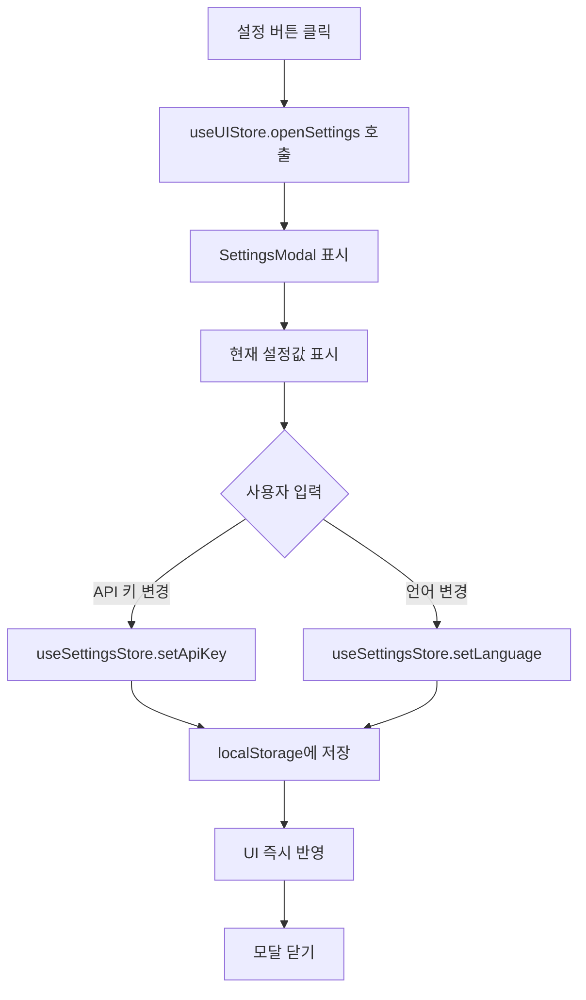

# 📐 Flight Number Searcher - 프로젝트 아키텍처

이 문서는 Flight Number Searcher 프로젝트의 전체적인 구조, 각 디렉토리의 역할, 그리고 애플리케이션의 실행 플로우를 설명합니다.

## 📂 프로젝트 구조

```
flight-number-searcher/
├── .github/
│   └── workflows/
│       └── deploy.yml          # GitHub Actions 배포 워크플로우
├── docs/
│   └── ARCHITECTURE.md         # 이 문서
├── public/                     # 정적 파일 (빌드 시 그대로 복사됨)
├── src/
│   ├── components/             # React 컴포넌트
│   │   ├── details/           # 항공편 상세 정보 관련
│   │   │   └── FlightDetailModal.tsx
│   │   ├── results/           # 검색 결과 표시 관련
│   │   │   └── FlightList.tsx
│   │   ├── search/            # 검색 폼 관련
│   │   │   ├── Autocomplete.tsx
│   │   │   └── SearchForm.tsx
│   │   ├── settings/          # 설정 관련
│   │   │   └── SettingsModal.tsx
│   │   └── ui/                # 공통 UI 컴포넌트
│   │       └── Modal.tsx
│   ├── data/                  # 정적 데이터
│   │   ├── airlines.ts        # 항공사 목록 (IATA 코드 + 이름)
│   │   ├── airports.ts        # 공항 목록 (IATA 코드 + 이름)
│   │   └── locales.ts         # 다국어 번역 데이터
│   ├── services/              # 외부 서비스 연동
│   │   └── api.ts             # FlightAPI.io API 호출 로직
│   ├── stores/                # Zustand 상태 관리
│   │   ├── useSearchStore.ts  # 검색 관련 상태
│   │   ├── useSettingsStore.ts # 설정 관련 상태
│   │   └── useUIStore.ts      # UI 상태 (모달 등)
│   ├── utils/                 # 유틸리티 함수
│   │   └── utils.ts
│   ├── types.ts               # TypeScript 타입 정의
│   ├── App.tsx                # 메인 App 컴포넌트
│   ├── App.css                # App 스타일
│   ├── index.css              # 글로벌 스타일
│   └── main.tsx               # 애플리케이션 진입점
├── index.html                 # HTML 템플릿
├── vite.config.js             # Vite 설정
├── tsconfig.json              # TypeScript 설정
├── tsconfig.node.json         # Node.js용 TypeScript 설정
├── eslint.config.js           # ESLint 설정
├── package.json               # 프로젝트 메타데이터 및 의존성
└── .gitignore                 # Git 무시 파일 목록
```

## 🗂️ 디렉토리별 역할

### `/src/components/`
React 컴포넌트를 기능별로 분류하여 저장합니다.

- **`details/`**: 항공편 상세 정보를 표시하는 모달 컴포넌트
- **`results/`**: 검색 결과 목록을 표시하는 컴포넌트
- **`search/`**: 검색 폼과 자동완성 입력 컴포넌트
- **`settings/`**: 설정 모달 (API 키, 언어 설정)
- **`ui/`**: 재사용 가능한 공통 UI 컴포넌트 (Modal 등)

### `/src/data/`
애플리케이션에서 사용하는 정적 데이터를 관리합니다.

- **`airlines.ts`**: 전 세계 주요 항공사의 IATA 코드와 이름 매핑
- **`airports.ts`**: 전 세계 주요 공항의 IATA 코드와 이름 매핑
- **`locales.ts`**: 다국어 지원을 위한 번역 데이터 (한국어, 영어, 일본어)

### `/src/services/`
외부 API와의 통신을 담당하는 서비스 레이어입니다.

- **`api.ts`**: FlightAPI.io API 호출, 캐싱, 페이지네이션 처리

### `/src/stores/`
Zustand를 사용한 전역 상태 관리 스토어입니다.

- **`useSearchStore.ts`**: 검색 조건, 검색 결과, 로딩/에러 상태 관리
- **`useSettingsStore.ts`**: API 키, 언어 설정 관리 (localStorage 연동)
- **`useUIStore.ts`**: 모달 표시 상태 관리

### `/src/utils/`
공통으로 사용되는 유틸리티 함수들입니다.

- **`utils.ts`**: 쿼리 스트링 파싱, sleep 함수 등

### `.github/workflows/`
GitHub Actions CI/CD 워크플로우 정의 파일입니다.

- **`deploy.yml`**: `main` 브랜치 푸시 시 자동으로 빌드하고 GitHub Pages에 배포

## 🔄 애플리케이션 실행 플로우

### 1️⃣ 초기 로딩



### 2️⃣ 항공편 검색 플로우



### 3️⃣ 항공편 상세 정보 조회



### 4️⃣ 설정 관리



## 🔌 API 통신 상세

### FlightAPI.io Schedule API

**엔드포인트**: `https://api.flightapi.io/schedule/{API_KEY}`

**주요 파라미터**:
- `mode`: `departures` (출발편 기준 조회)
- `iata`: 출발 공항 IATA 코드
- `day`: 오늘 기준 상대 일수 (1 = 오늘, 2 = 내일, ...)
- `page`: 페이지 번호 (페이지네이션)

**응답 구조**:
```typescript
{
  airport: {
    pluginData: {
      schedule: {
        departures: {
          data: [
            {
              flight: {
                identification: { number: { default: "KE701" } },
                airline: { code: { iata: "KE" } },
                airport: {
                  origin: { code: { iata: "ICN" } },
                  destination: { code: { iata: "NRT" } }
                },
                time: {
                  scheduled: { departure: 1234567890 }
                }
              }
            }
          ],
          page: { current: 1, total: 3 }
        }
      }
    }
  }
}
```

### 캐싱 전략

- **캐시 키**: `flight_cache_{PROVIDER}_{date}_{airline}_{origin}_{destination}`
- **유효 기간**: 1시간 (3600초)
- **저장소**: `localStorage`
- **캐시 구조**:
  ```json
  {
    "timestamp": 1700000000000,
    "data": [...]
  }
  ```

## 🎨 상태 관리 아키텍처

### Zustand 스토어 구조

```typescript
// useSearchStore
{
  criteria: SearchCriteria | null,      // 현재 검색 조건
  results: FlightResult[],              // 검색 결과
  isLoading: boolean,                   // 로딩 상태
  error: string | null,                 // 에러 메시지
  searchFlights: (params, apiKey) => Promise<void>
}

// useSettingsStore
{
  apiKey: string,                       // FlightAPI.io API 키
  language: 'ko' | 'en' | 'ja',        // 선택된 언어
  setApiKey: (key: string) => void,
  setLanguage: (lang: string) => void
}

// useUIStore
{
  isSettingsOpen: boolean,              // 설정 모달 표시 여부
  isFlightDetailOpen: boolean,          // 상세 모달 표시 여부
  selectedFlight: FlightResult | null,  // 선택된 항공편
  openSettings: () => void,
  closeSettings: () => void,
  openFlightDetail: (flight) => void,
  closeFlightDetail: () => void
}
```

## 🚀 빌드 및 배포 프로세스

### 로컬 개발

```bash
npm run dev
# Vite 개발 서버 시작 (http://localhost:5173)
# - HMR (Hot Module Replacement) 지원
# - TypeScript 실시간 컴파일
```

### 프로덕션 빌드

```bash
npm run build
# 1. TypeScript 컴파일 (tsc)
# 2. Vite 번들링 및 최적화
# 3. dist/ 폴더에 결과물 생성
#    - index.html
#    - assets/index-[hash].js
#    - assets/index-[hash].css
```

### GitHub Pages 배포

1. `main` 브랜치에 코드 푸시
2. GitHub Actions 워크플로우 자동 실행 (`.github/workflows/deploy.yml`)
3. 단계:
   - Checkout 코드
   - Node.js 20 설치
   - `npm ci` (의존성 설치)
   - `npm run build` (프로덕션 빌드)
   - `dist/` 폴더를 `gh-pages` 브랜치에 배포
4. GitHub Pages에서 자동으로 서빙

**배포 URL**: `https://<username>.github.io/flight-number-searcher/`

## 🛠️ 개발 가이드

### 새로운 컴포넌트 추가

1. `/src/components/` 하위에 적절한 카테고리 폴더 선택 또는 생성
2. TypeScript + React 컴포넌트 작성 (`.tsx` 확장자)
3. 필요시 스토어에서 상태 가져오기
4. 부모 컴포넌트에서 import 및 사용

### 새로운 API 제공자 추가

1. `/src/services/api.ts`의 `Provider` 타입에 새 제공자 추가
2. `fetchFlightsFromProvider` 함수에 새 제공자 로직 추가
3. API 응답을 `FlightResult[]` 형식으로 변환

### 다국어 추가

1. `/src/data/locales.ts`의 `LOCALES` 객체에 새 언어 추가
2. 모든 키에 대한 번역 제공
3. `Language` 타입에 새 언어 코드 추가

### 스타일 수정

- **글로벌 스타일**: `/src/index.css`
- **컴포넌트별 스타일**: `/src/App.css` 또는 인라인 스타일
- **CSS 변수**: `index.css`의 `:root`에서 색상, 간격 등 정의

## 🧪 테스트 및 디버깅

### 개발자 도구 활용

- **콘솔 로그**: API 요청/응답, 캐시 히트/미스 등이 자동으로 로깅됨
- **React DevTools**: 컴포넌트 트리 및 props 확인
- **Zustand DevTools**: 상태 변화 추적 (별도 설치 필요)

### 데모 모드

API 키 없이 테스트하려면:
```typescript
// src/services/api.ts
export let PROVIDER: Provider = 'demo'; // 'flightapi' 대신 'demo' 사용
```

## 📊 성능 최적화

### 현재 적용된 최적화

1. **API 응답 캐싱**: 동일한 검색 조건에 대해 1시간 동안 캐시 사용
2. **페이지네이션 병렬 처리**: 여러 페이지를 `Promise.all`로 동시 요청
3. **중복 제거**: 항공편 번호 + 출발 시각 기준으로 중복 제거
4. **Vite 빌드 최적화**: 코드 스플리팅, 트리 쉐이킹, 압축

### 추가 최적화 가능 영역

- React.memo를 사용한 컴포넌트 메모이제이션
- Virtual scrolling (검색 결과가 많을 경우)
- Service Worker를 통한 오프라인 지원

## 🔒 보안 고려사항

1. **API 키 관리**: 
   - localStorage에 저장 (클라이언트 사이드)
   - 민감한 정보이므로 절대 Git에 커밋하지 말 것
   - 프로덕션에서는 백엔드 프록시 사용 권장

2. **CORS**: 
   - FlightAPI.io는 CORS를 지원하므로 클라이언트에서 직접 호출 가능
   - 다른 API 사용 시 CORS 정책 확인 필요

3. **XSS 방지**: 
   - React의 기본 XSS 보호 활용
   - 사용자 입력은 자동으로 이스케이프됨

## 📝 유지보수 체크리스트

### 정기 점검 항목

- [ ] 의존성 업데이트 (`npm outdated` 확인)
- [ ] 보안 취약점 점검 (`npm audit`)
- [ ] TypeScript 타입 에러 확인 (`npx tsc --noEmit`)
- [ ] ESLint 경고 확인 (`npm run lint`)
- [ ] 빌드 성공 확인 (`npm run build`)
- [ ] 배포 상태 확인 (GitHub Actions 워크플로우)

### 문제 해결

**빌드 실패 시**:
1. `node_modules` 삭제 후 `npm install` 재실행
2. TypeScript 에러 확인
3. Vite 설정 확인

**API 호출 실패 시**:
1. API 키 유효성 확인
2. 네트워크 탭에서 요청/응답 확인
3. CORS 에러 확인
4. API 제공자 상태 페이지 확인

**배포 실패 시**:
1. GitHub Actions 로그 확인
2. `vite.config.js`의 `base` 경로 확인
3. GitHub Pages 설정 확인

## 🔗 참고 자료

- [React 공식 문서](https://react.dev/)
- [Vite 공식 문서](https://vitejs.dev/)
- [Zustand 공식 문서](https://zustand-demo.pmnd.rs/)
- [FlightAPI.io 문서](https://flightapi.io/documentation)
- [TypeScript 핸드북](https://www.typescriptlang.org/docs/)
